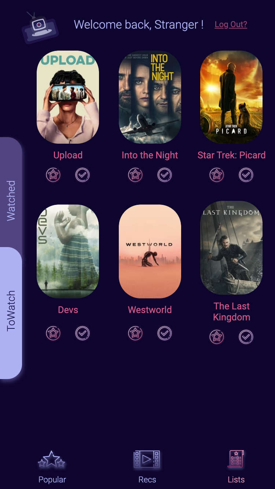
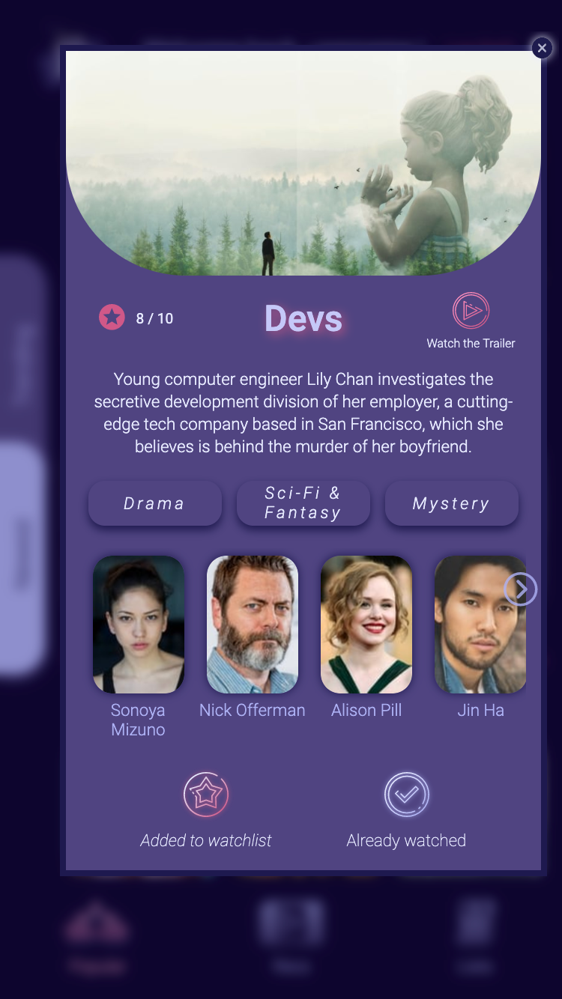

# ShowCased

ShowCased 🎬 is your app to discover new shows and track what you've already seen. It gives personal recommendations based on your watch lists 👀 - the more you use it the better it becomes 💪

## Motivation

This app was created as the capstone project for my bootcamp around web development. The idea was to have an on-the-go app that will show recommendations independent of any particular streaming provider but still based on a viewing profile.

## Overview

<p align="center">
 
</p>

## Techs

- MERN Stack
- [storybook](https://github.com/storybookjs/storybook)
- [emotion](https://github.com/emotion-js/emotion)
- [mongoose](https://github.com/Automattic/mongoose)
- [react-query](https://github.com/tannerlinsley/react-query)
- [node-fetch](https://github.com/node-fetch/node-fetch)
- [jwt](https://github.com/auth0/node-jsonwebtoken)
- [joi](https://github.com/hapijs/joi)
- [bcrypt](https://github.com/dcodeIO/bcrypt.js)

## Features

- Dynamic updates on new and trending shows
- Recommendations based on your watch lists
- Extensive API (_The Movie Database_)
- User authentication

## Development / Deployment

Install client and server dependencies:

```
npm install
cd client
npm install
```

Add environment variables in .env file. You can copy the .env.example and update the variables.

```
cp .env.example .env
```

For this app to run you need to have a key for _The Movie Database API_. You need to make an account [here](https://www.themoviedb.org/account/signup?language=en-US) and then you find your key under settings -> API.

Also for the user authentication a jwt secret is needed.

_Please update these two variables in the `.env`!_

To start the server and client in development mode at the same time:

```
npm run dev
```

To also run the storybook alongside server and client:

```
npm run dev-story
```

If you like to run the production build, you have to build the client first.

```
npm run build
npm start
```

## Credits

The logo was created after a vector by <a href="https://www.freepik.com/studiogstock">studiogstock</a>.

Login Background by <a href="https://unsplash.com/@thibaultpenin?utm_source=unsplash&utm_medium=referral&utm_content=creditCopyText">Thibault Pinin</a> on <a href="https://unsplash.com/">Unsplash</a>

Register Background by <a href="https://unsplash.com/@adrienolichon?utm_source=unsplash&utm_medium=referral&utm_content=creditCopyText">Adrien Olichon</a> on <a href="https://unsplash.com/">Unsplash</a>

Icons made by <a href="https://www.flaticon.com/authors/good-ware" title="Good Ware">Good Ware</a> and <a href="https://www.flaticon.com/authors/iconixar" title="iconixar">iconixar</a> from <a href="https://www.flaticon.com/" title="Flaticon"> www.flaticon.com</a>
